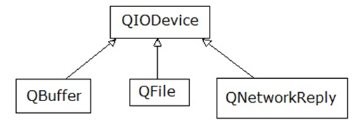

.. -*- coding: utf-8 -*-

.. _rcs_subversion:

Clase 08 - POO 2018
===================
(Fecha: 9 de abril)

:Tarea para Clase 10:
	Ver `Tutorial Qt QVector <https://www.youtube.com/watch?v=Z9u2yDPh57U>`_ de `Videos tutoriales de Qt <https://www.youtube.com/playlist?list=PL54fdmMKYUJvn4dAvziRopztp47tBRNum>`_

	Ver `Tutorial Qt QDateTime <https://www.youtube.com/watch?v=bZmGhmKv5iE>`_ de `Videos tutoriales de Qt <https://www.youtube.com/playlist?list=PL54fdmMKYUJvn4dAvziRopztp47tBRNum>`_

	Ver `Tutorial Qt signals & slots <https://www.youtube.com/watch?v=IITGountoO4>`_ de `Videos tutoriales de Qt <https://www.youtube.com/playlist?list=PL54fdmMKYUJvn4dAvziRopztp47tBRNum>`_

QByteArray
^^^^^^^^^^

- Se podría decir que es administrador de un char*
- Se puede usar el operador []
- Almacena \\000 al final de cada objeto QByteArray

QTextEdit
^^^^^^^^^

- Un QWidget que muestra texto plano o enriquecido
- Puede mostrar imágenes, listas y tablas
- La barra de desplazamiento es automática
- Interpreta tags HTML
- Seteamos texto con setPlainText()

**Ejercicio 7**

- Crear una aplicación que inicie con un login validando el usuario admin:123
- Luego de ingresar el usuario válido, mostrar un nuevo QWidget con las siguientes características:
	- Definida en la clase Editor
	- Contendrá un QTextEdit vacío, un QPushButton "Buscar" y un QLabel
	- El usuario podrá escribir cualquier texto en el QTextEdit
	- Al presionar "Buscar" se detectará automáticamente la cantidad de letras 'a' en el texto y colocará el resultado en el QLabel.
- Luego de dejar funcionando lo anterior, agregar lo siguiente:
	- Un QLineEdit y un QPushButton "Borrar"
	- En este QLineEdit el usuario puede colocar una palabra o frase
	- Al presionar Borrar se buscará en el texto y se eliminarán

**CamelCase**: Es escribir con la forma de jorobas de camello con las mayúsculas y minúsculas. 

- UpperCamelCase: La primera letra de cada palabra es mayúscula. Ejemplo: EjemploDeUpperCamelCase.
- lowerCamelCase: Igual a UpperCamelCase con excepción de la primer palabra. Ejemplo: ejemploDeLowerCamelCase

Sutilezas con punteros
^^^^^^^^^^^^^^^^^^^^^^

.. code-block:: c

	char cadena[10] = "hola";  
	// Funciona? sí. Qué hace con el sobrante?
	// Los completa a todos con \000

	char cadena[4] = "hola";   // Por qué no compila?

	char cadena[5] = "hola";   // Y por qué esto sí compila?

	// Porque la última posición se usa para el carácter nulo que el
	// compilador lo agrega (si tiene lugar).

	//    \000  (octal)
	//    \x0   (hexadecimal)    

Usando puntero para cadenas
^^^^^^^^^^^^^^^^^^^^^^^^^^^

.. code-block:: c

	char* cadena = "hola";      // el compilador agrega \000
	char* cadena = "ho\000la";  // Imprime  ho

- Asignamos memoria dinámicamente.
- No necesitamos especificar la longitud máxima.

Notación octal y hexadecimal
^^^^^^^^^^^^^^^^^^^^^^^^^^^^

.. code-block:: c

	cout << 3 + 4 + 11;      // Imprime 18
	cout << 3 + 4 + 011;     // ?

	//    octal    hexadecimal    decimal
	//    0121     0x51           81
	//    011      0x9            9
	//    '\000'   '\x0'          nulo
	//    '\063'   '\x33'         carácter 3

Punteros a punteros
^^^^^^^^^^^^^^^^^^^

.. code-block:: c

	char cadena[2][3];
	cadena[0][0] = 'f';
	cadena[0][1] = 'u';
	cadena[0][2] = 'e';
	cadena[1][0] = 'f';
	cadena[1][1] = 'u';
	cadena[1][2] = 'i';

	//    Mejor así

	char cadena[2][3];
	cadena[0][0] = 's';
	cadena[0][1] = 'i';
	cadena[0][2] = '\000';
	cadena[1][0] = 'n';
	cadena[1][1] = 'o';
	cadena[1][2] = '\000';
 
Array ≡ puntero
^^^^^^^^^^^^^^^

- Cuando declaramos un array
- Estamos declarando un puntero al primer elemento.

.. code-block:: c

	char arreglo[5];
	char* puntero;
	puntero = arreglo;  // Equivale a puntero = &arreglo[0];

Volviendo a puntero a puntero
^^^^^^^^^^^^^^^^^^^^^^^^^^^^^

.. code-block:: c

	char cadena[2][3] = {{'s', 'i', '\000'}, {'n', 'o', '\000'}};
	// Y si fuera char cadena[2][3] = {{'s', 'i', '-'}, {'n', 'o', '\000'}};
	char* p1;
	char* p2;

	p1 = cadena[0];   // p1 = &cadena[0][0];
	p2 = cadena[1];   // p2 = &cadena[1][0];

	cout << p1;  // si  
	cout << p2;  // no
	
	cout << *p1;  // ?
	cout << *p2;  // ?

	// Es decir:
	//    El identificador de un arreglo unidimensional 
	//    es considerado un puntero a su primer elemento.

**Ejemplo**

.. code-block:: c

	char p1[] = {'a', 'b', 'c', 'd', 'e'};
	cout << "Letra " << *p1;   // Letra a
	cout << "Letra " << p1[0];   // Letra a

	char m2[][5] = {{'a', 'b', 'c', 'd', 'e'}, {'A', 'B', 'C', 'D', 'E'}};
	cout << "Letra " << **m2;          // Letra a
	cout << "Letra " << m2[0][0];      // Letra a
	cout << "Letra " << m2[1][3];      // Letra D
	cout << "Letra " << *(*(m2+1)+3);  // Letra D

**Extendiendo a arreglos de cualquier dimensión**

.. code-block:: c

	m[a] == *(m+a)
	m[a][b] == *(*(m+a)+b)
	m[a][b][c] == *(*(*(m+a)+b)+c)

	//    Si nos referimos al primer elemento

	m[0] == *m
	m[0][0] == **m
	m[0][0][0] == ***m

**Array como parámetro en funciones**

.. code-block:: c

	#include <iostream>
	using namespace std;

	void funcion( int miArray[] );
	// Le estamos pasando un puntero al primer elemento del array.

	int main()  {
	    int miA[ 5 ] = { 0, 1, 2, 3, 4 };

	    funcion( miA );

	    cout << miA[ 0 ] << miA[ 1 ] << miA[ 2 ] << miA[ 3 ] << miA[ 4 ];
	}

	void funcion( int miArray[] )  {
	    miArray[ 0 ] = 5;  // Las modificaciones quedarán.

	    miArray[ 3 ] = 5; 
	} 

El preprocesador
^^^^^^^^^^^^^^^^

-	Analiza el archivo fuente antes de la compilación real
-	Realiza las sustituciones de macros
-	Una macro es un patrón de sustitución formado por expresiones textuales
-	Procesa las directivas (``#include``, ``#define``, ``#ifndef``, ...)
-	Elimina los comentarios.

**Directivas #ifdef #endif #ifndef**

- Con ``#ifdef`` si la macro está definida, entonces hace lo siguiente hasta encontrar un ``#endif``
- ``#ifndef`` pregunta si no está definida

**Directiva #include**

- Inserta archivos
- Influye sobre el ámbito y los identificadores

.. code-block:: c

	#include <nombre de fichero cabecera>
	#include "nombre de fichero de cabecera"

**Directiva #define**

- Define macros para sustituir cada vez que se encuentre el identificador.

.. code-block:: c

	#define identificador <secuencia>
	
-	Si 'secuencia' no existe, el identificador será eliminado cada vez que aparezca
-	No es necesario añadir un punto y coma al final
-	Termina en el primer retorno de línea encontrado
-	Podríamos definir un nuevo lenguaje
 
.. figure:: images/clase07/define.png

**Ejercicio 1:**

- Nuevo proyecto Empty 
- Crear un .h vacío y definir una clase Persona con int edad y string nombre.
- En el archivo ``main.cpp`` incluir dos veces el archivo .h
- Tratar de resolver el problema sólo modificando el .h

.. ..

 <!---  
 - El problema se soluciona con el uso del Guardián de inclusión múltiple:

 #ifndef PRINCIPAL_H
 #define PRINCIPAL_H

 // . . . 

 #endif // PRINCIPAL_H
 --->

Web Service
^^^^^^^^^^^

- Para intercambiar datos entre aplicaciones
- Generalmente a través del protocolo HTTP
- La info puede viajar en XML, JSON, etc.
- Fomenta y facilita el uso y desarrollo de APIs Web
- https://es.wikipedia.org/wiki/Servicio_web

**Algunas APIs disponibles**

- Twitter - https://dev.twitter.com
- Facebook - https://developers.facebook.com
- Amazon - https://developer.amazonservices.es
- Spotify - https://developer.spotify.com/web-api
- MercadoLibre - http://developers.mercadolibre.com
- Google - https://developers.google.com
	- Youtube
	- Traductor
	- Google+
	- Maps
	- Street View
	- MercadoLibre

**Google Maps**

- URL para su uso: https://developers.google.com/maps/documentation/staticmaps
- Ejemplo: http://maps.googleapis.com/maps/api/staticmap?center=rondeau+100+cordoba&zoom=15&size=500x300&maptype=roadmap&sensor=false
- Descripción de los parámetros en: https://developers.google.com/maps/documentation/staticmaps/#URL_Parameters
- Pueden habilitar otros servicios en https://code.google.com/apis/console

**QUrl**

- Para manipular una url ingresada por el usuario 

.. code-block:: c
	
	// URL ejemplo: http://www.yahoo.com.ar/documento/info.html
		
	// El método path() devuelve /documento/info.html
	// El método host() devuelve www.yahoo.com.ar
	
	QUrl url("http://www.yahoo.com.ar/documento/info.html");
	qDebug() << url.host();
	qDebug() << url.path();
	
Dibujar a mano sobre un QWidget
^^^^^^^^^^^^^^^^^^^^^^^^^^^^^^^

.. code-block:: c

	// mapa.h
	#include <QWidget>

	class Mapa : public QWidget  {
	    Q_OBJECT

	public:
	    Mapa()  {  }

	protected:
	    void paintEvent(QPaintEvent *);

	};

	// mapa.cpp
	#include "mapa.h"
	#include <QPainter>

	void Mapa::paintEvent(QPaintEvent *)  {
	    QPainter painter(this);
	    painter.drawLine(0, 0, this->width(), this->height());
	}

**Clase QPainter**

- Pinta a bajo nivel sobre widgets.
- Debe ser utilizado dentro del método ``paintEvent(QPaintEvent*)``.

.. code-block:: c

	void drawEllipse(int x, int y, int ancho, int alto)
	void drawImage(int x, int y, QImage & image)
	void drawLine(int x1, int y1, int x2, int y2)
	void drawText(int x, int y, QString & text)
	void fillRect(int x, int y, int ancho, int alto)
	
**Ejercicio:** Comenzar un proyecto vacío con QtCreator y diseñar un login de usuarios:
 
.. figure:: images/clase07/login.png 

- Tendrá un tamaño de 250x120 píxeles y llevará por título "Login".
- El único usuario válido es: (DNI del alumno):(últimos 3 números del DNI)
- Ocultar con asteriscos la clave.
- Si el usuario y clave no es válido, sólo el campo de la clave se deberá limpiar.
- Al fallar la clave 3 veces, la aplicación se cierra. 
- Si el usuario es válido, entonces se oculta el login y se visualiza un nuevo QWidget como el que sigue:

.. figure:: images/clase07/ventana.png

- Utilizar una imagen del disco aproximadamente de 100x100 píxeles.
- Esta imagen se mostrará en el QWidget exactamente centrada.
- Dibujar además un cuadrado que envuelva la imagen (como muestra el ejemplo).
- La ventana puede tener cualquier tamaño pero llevará por título "Ventana".

Clase QNetworkAccessManager
^^^^^^^^^^^^^^^^^^^^^^^^^^^

- Permite enviar y recibir solicitudes a la red
- Se obtiene un objeto ``QNetworkReply`` con toda la información recibida

.. code-block:: c

	QNetworkAccessManager* manager = new QNetworkAccessManager;

	connect(manager, SIGNAL(finished(QNetworkReply*)), this, SLOT(slot_respuesta(QNetworkReply*)));

	manager->get(QNetworkRequest(QUrl("http://mi.ubp.edu.ar")));

- Para poder utilizar las clases de network hay que agregar en el .pro

.. code-block:: c

	QT += network  // Esto agrega al proyecto el módulo network

- Por defecto, el módulo 'gui' y el módulo 'core' están incluidos.
- Para utilizar HTTPS, Qt utiliza OpenSSL https://www.openssl.org/source
	- Posiblemente sea más fácil descargarlo desde https://slproweb.com/products/Win32OpenSSL.html
	- Por ejemplo, para 64 bits elegir `Win64 OpenSSL v1.0.2h <https://slproweb.com/download/Win64OpenSSL-1_0_2h.exe>`_

Clase QIODevice
^^^^^^^^^^^^^^^

- Clase base de los dispositivos de I/O
- Algunos métodos:

.. code-block:: c

	QByteArray readAll()  		 // Lee todos los datos disponibles.
	QByteArray read(qint64 max)  // Lee hasta max datos disponibles.
	QByteArray readLine()  		 // Lee una linea.

Clase QNetworkReply
^^^^^^^^^^^^^^^^^^^

- Contiene los datos y encabezado de una respuesta
- Una vez leídos los datos, ya no quedarán disponibles.
- Para controlar los bytes que se van descargando usar la señal:

.. code-block:: c

	void downloadProgress(qint64 bytesRecibidos, qint64 bytesTotal)

Clase QNetworkRequest
^^^^^^^^^^^^^^^^^^^^^

- Contiene la información que se envían en la petición
- Seteamos algún campo de la cabecera con:

.. code-block:: c

	void setRawHeader(const QByteArray &nombre, const QByteArray & valor)

	QNetworkRequest request;
	request.setUrl(QUrl(ui->le->text()));
	request.setRawHeader("User-Agent", "MiNavegador 1.0");

Clase QNetworkProxyFactory
^^^^^^^^^^^^^^^^^^^^^^^^^^

- Permite configurar un servidor proxy a nuestra aplicación Qt.
- Lo siguiente utiliza la configuración del sistema (Chrome y IE, no Firefox).

.. code-block:: c

	#include <QApplication>
	#include "principal.h"
	#include <QNetworkProxyFactory>

	int main(int argc, char *argv[])  {
	    QApplication a(argc, argv);

	    QNetworkProxyFactory::setUseSystemConfiguration(true);

	    Principal w;
	    w.showMaximized();

	    return a.exec();
	}

Obtener una imagen desde internet
^^^^^^^^^^^^^^^^^^^^^^^^^^^^^^^^^

.. code-block:: c

	void Principal::slot_descargaFinalizada(QNetworkReply *reply)  {
	    QImage image = QImage::fromData(reply->readAll());
	}

**Ejercicio 8** 

- Hacer una aplicación para buscar una dirección en Google Maps
- Definir la clase Mapa. Será el QWidget donde se dibujará el mapa de google.
- Definir la clase Ventana para contener al layout.
- Ese layout tendrá:
	- QLineEdit para ingresar un domicilio
	- QPushButton para buscar ese domicilio
	- Mapa
	- QSlider vertical para aumentar y disminuir el zoom

