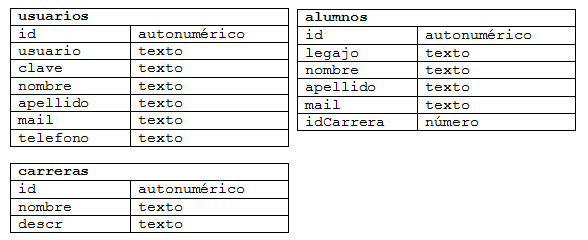

.. -*- coding: utf-8 -*-

.. _rcs_subversion:

Clase 09 - POO 2017
===================

.. figure:: images/clase09/java_vs_cplusplus.gif

- Para crear gifs a partir de videos en youtube en: https://gifs.com 

Clases derivadas
^^^^^^^^^^^^^^^^

.. code-block:: c
 
	// personal.h
	#include <QString>

	class Personal  {
	public:
	    QString verEdad()  {  return "Edad: " + QString::number(edad);  }
	    QString verSalario()  {  return "Salario: " + QString::number(salario);  }

	protected:  // Para acceso desde las clases derivadas
	    int edad;
	    int salario;
	};

	// Modificadores de acceso para Herencia:
	//    public  ->  Mantiene los modificadores de acceso de la clase base
	//    private ->  Pasa todo a privado
	class Desarrollador : public Personal  {
	public:
	    Desarrollador(int edad)  {
	    salario = 2000;
	    this->edad = edad;
	}

	// Se podrá usar? 
	Desarrollador(int edad) : salario(2000), edad(edad)  {  }
	    // No. Sólo para miembros de la propia clase (no para heredados).
	};

	class Administrador : public Personal  {
	public:
	    Administrador()  {
	        salario = 2000;
	        edad = 30;
	    }
	};

	#include <QApplication>
	#include "personal.h"
	#include <QDebug>

	int main(int argc, char** argv)  {
	    QApplication a(argc, argv);

	    Desarrollador juan(20);
	    Administrador marcos;

	    qDebug() << juan.verEdad();
	    qDebug() << juan.verSalario();

	    qDebug() << marcos.verEdad();
	    qDebug() << marcos.verSalario();

	    return a.exec();
	}

Constructor de la clase derivada
^^^^^^^^^^^^^^^^^^^^^^^^^^^^^^^^

.. code-block:: c

	class Persona  {
	public:
	    Persona(int edad) : edad(edad)  {  }
	    QString verEdad()  {  return "Edad: " + QString::number(edad);  }
	    void setEdad(int edad)  {  this->edad = edad;  }

	protected:
	    int edad;
	};

	class Empleado : public Persona  {
	public:
	    // Siempre primero se llama al constructor de la clase base
	    Empleado(int edad, int salario) : Persona(edad), salario(salario)  {  }
	    QString verSalario()  {  return "Salario: " + QString::number(salario);  }

	protected:
	    int salario;
	};

	#include <QApplication>
	#include "personal.h"
	#include <QDebug>

	int main(int argc, char** argv)  {
	    QApplication a(argc, argv);

	    Persona carlos(24);
	    Empleado ale(20, 2500);

	    qDebug() << carlos.verEdad();
	    //    qDebug() << carlos.verSalario();  // No compila. No está en la clase base.

	    qDebug() << ale.verEdad();
	    qDebug() << ale.verSalario();

	    return a.exec();
	}

Destructor de la clase derivada
^^^^^^^^^^^^^^^^^^^^^^^^^^^^^^^

.. code-block:: c

	class ClaseA  {
	public:
	    ClaseA() : datoA(10)  {  qDebug() << "Constructor A";  }
	    ~ClaseA()  {  qDebug() << "Destructor A";  }
	    int verA()  {  return datoA;  }

	protected:
	    int datoA;
	};

	class ClaseB : public ClaseA  {
	public:
	    ClaseB() : datoB(20)  {  qDebug() << "Constructor B";  }
	    ~ClaseB()  {  qDebug() << "Destructor B";  }
	    int verB()  {  return datoB;  }

	protected:
	    int datoB;
	};

	#include <QApplication>
	#include "personal.h"
	#include <QDebug>

	int main(int argc, char** argv)  {
	    QApplication a(argc, argv);

	    {
	    ClaseB objeto;
	    qDebug() << "a=" << objeto.verA() << ", b=" << objeto.verB();
	    }

	    return a.exec();
	}

	// Publica
	Constructor A
	Constructor B
	a=10, b=20
	Destructor B
	Destructor A

Conexión a base de datos
^^^^^^^^^^^^^^^^^^^^^^^^

**Ejemplo de la estructura de las tablas en la base de datos**

- Con Qt se pueden utilizar los siguientes motores de base de datos:
	- **ODBC (Open DataBase Connectivity)**: 
		- Estándar de acceso a base de datos
		- Usado con Microsoft Access en Windows
		- Está disponible en Windows: Panel de control -> Herramientas administrativas -> ODBC Data sources
			
	- **SQLite**
		- Es un sistema de gestión de bases de datos relacional.
		- En C y libre
		- Los datos se almacenan en un archivo
		- No es cliente-servidor. La librería (dll) tiene funciones para trabajar
		- No requiere instalación, directamente con un ejecutable
		- Para Linux, Windows, Mac OS, Android, iOS, BlackBerry OS, Windows Phone, ...
		- Algunas aplicaciones que usan SQLite: Skype, Firefox, Photoshop, ...
			
	- **MySQL**
		- Quizás el motor de base de datos más utilizado
		- Usado por los más grandes: Facebook, Twitter, YouTube, Wikipedia, ...
		- Requiere una instalación más avanzada para usar con Qt dependiendo el SO que se utilice.
		
Usando SQLite
^^^^^^^^^^^^^

**Creación de una base de datos SQLite**
	
- Descargar de http://www.sqlite.org/download.html
- Precompiled Binaries for Windows–Linux–MAC (The command-line shell program)
- En Linux se puede hacer: ``sudo apt-get install sqlite3``
- Al descomprimir tenemos el ejecutable sqlite3
- Creamos una carpeta C:/Qt/db (o /home/db) y copiamos ahí el ejecutable
- En consola creamos una base de datos, por ejemplo, llamada ``test`` con una tabla ``usuarios``

::

	sqlite3 test

	create table usuarios (
	    id integer primary key,  (es autoincrementable)
	    usuario varchar(30),
	    clave varchar(30),
	    nombre varchar(50),
	    apellido varchar(50),
	    mail varchar(50)
	);

	// Podemos insertar un registro 

	insert into usuarios (usuario, clave,	nombre, apellido, mail) 
	values ("cgomez", "1234", "Carlos", "Gomez", "cgomez@gmail.com");

	// Podemos ver el contenido de la tabla "usuario":

	select * from usuarios;

	// Para salir de la base:
		
	.exit

En Qt	
^^^^^

- Requiere QT += sql
- Para averiguar los controladores disponibles, usamos el método estático:

.. code-block:: c

	qDebug() << QSqlDatabase::drivers();  // Devuelve un QStringList

- Un objeto QSqlDatabase representa la conexión a la base
- Elegimos el controlador y conectamos:

.. code-block:: c

	QSqlDatabase db = QSqlDatabase::addDatabase("QSQLITE");

	db.setDatabaseName("C:/Qt/db/test"); 
	if (db.open())
	    qDebug() << "Conexión exitosa";
	else
	    qDebug() << "No se pudo abrir la base";

- En Windows, para usar el archivo Access ``C:/db/base.mdb`` se hace lo siguiente:
	
.. code-block:: c
		
	QSqlDatabase db = QSqlDatabase::addDatabase("QODBC");

	db.setDatabaseName("DRIVER={Microsoft Access Driver (*.mdb, *.accdb)};"
	                   "DBQ=C:/db/base.mdb"); 
	if (db.open())
		qDebug() << "Conexión exitosa";

		
		

