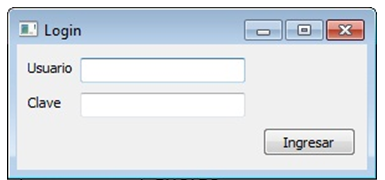

.. -*- coding: utf-8 -*-

.. _rcs_subversion:

Clase 11 - POO 2017
===================

**Ejemplo**: slot de la clase Login para que valide usuarios contra la base

.. code-block:: c

	void Login::slot_validar()  {
	    bool usuarioValido = false;

	    if (adminDB->getDB().isOpen())  {  
	        QSqlQuery* query = new QSqlQuery(adminDB->getDB());

	        query->exec("SELECT nombre, apellido FROM usuarios WHERE usuario='" + 
	        leUsuario->text() + "' AND clave='" + leClave->text() + "'");

	        // Si los datos son consistentes, devolverá un único registro.
	        while (query->next())  {

	            QSqlRecord record = query->record();

	            // Obtenemos el número de la columna de los datos que necesitamos.
	            int columnaNombre = record.indexOf("nombre");
	            int columnaApellido = record.indexOf("apellido");

	            // Obtenemos los valores de las columnas.
	            qDebug() << "Nombre=" << query->value(columnaNombre).toString();
	            qDebug() << "Apellido=" << query->value(columnaApellido).toString();

	            usuarioValido = true;
	        }

	        if (usuarioValido)  {
	            QMessageBox::information(this, "Conexión exitosa", "Válido");
	        }
	        else  {
	            QMessageBox::critical(this, "Sin permisos", "Usuario inválido");
	        }
	    }
	}

**Ejercicio 10**

- Diseñar una aplicación para una galería de fotos
- Debe tener una base con una tabla 'imagenes' que tenga las URLs de imágenes
- Un botón >> y otro << para avanzar o retroceder en la galería de fotos
- Se podrá navegar sobre las fotos que se descargarán desde internet
	
	
**Para independizar del SO**

.. code-block:: c

	AdminDB adminDB;
	QString nombreSqlite;

	#ifdef __APPLE__
	    nombreSqlite = "/home/cosimani/db/test";
	#elif __WIN32__
	    nombreSqlite = "C:/Qt/db/test";
	#elif __linux__
	    nombreSqlite = "/home/cosimani/db/test";
	#else
	    nombreSqlite = "/home/cosimani/db/test";
	#endif

	if (adminDB.conectar(nombreSqlite))
	    qDebug() << "Conexion exitosa";

		
Ejercitación para primer parcial
^^^^^^^^^^^^^^^^^^^^^^^^^^^^^^^^

**Ejercicio 11** 

- Definir la siguiente jerarquía de clases:
 
.. figure:: images/clase10/clases.png 

- Se pedirá definición de atributos y métodos (en papel y sin utilizar material de consulta)
- Instanciar objetos de estas clases.
- Prestar atención sobre los punteros a objetos, ámbitos, parámetros en funciones, modificadores de acceso, ...

**Ejercicio:** Aritmética de punteros - Escribir la salida por consola

.. code-block:: c

	#include <QApplication>
	#include <QDebug>

	int main(int argc, char** argv)  {
	    QApplication app(argc, argv);

	    int a = 10, b = 10, c = 10, d = 10, e = 10;
	    int m[10] = {1, 2, 3, 4, 5, 6, 7, 8, 9, 10};
	    int *p = &m[2], *q = &m[4];

	    qDebug() << a + m[d/c] + b-- / *q + 10 + e--;
	    p = m;
	    qDebug() << e + *p + m[4]++;

	    return 0;
	}
	

**Ejercicio 12**

- Comenzar un proyecto vacío con QtCreator y diseñar el siguiente login de usuarios:
 

- Este login tendrá las siguientes características:
	- Cuidar muy bien el layout. Notar la ubicación del botón con respecto a los campos.
	- Definido en la clase Login en los archivos login.h y login.cpp.
	- La ventana tendrá un tamaño de 250x120 píxeles y llevará por título "Login".
	- El único usuario válido es (DNI del alumno):(últimos 4 números del DNI)
	- Ocultar con asteriscos la clave.
	- Si el usuario y clave no es válido, sólo el campo de la clave se deberá limpiar.
	- Al fallar la clave 3 veces, la aplicación se cierra. 

- Si el usuario es válido, entonces se ocultará el login y se visualizará un nuevo QWidget como el que sigue:

.. figure:: images/clase10/ventana.png  
 
- Este widget tendrá las siguientes características:
 	- Definido en la clase Ventana en los archivos ventana.h y ventana.cpp.
	- Con QNetworkAccessManager descargar una imagen cualquiera de 100x100 píxeles.
	- Esta imagen se mostrará en el QWidget centrada (como muestra el ejemplo).
	- Dibujar además un cuadrado que envuelva la imagen (como muestra el ejemplo).
	- La ventana puede tener cualquier tamaño y llevará por título "Ventana".

Un par de memes antes del examen
^^^^^^^^^^^^^^^^^^^^^^^^^^^^^^^^

.. figure:: images/clase10/meme2.jpg

.. figure:: images/clase10/meme4.jpg

	

