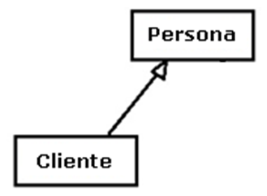

.. -*- coding: utf-8 -*-

.. _rcs_subversion:

Clase 11 - POO 2017 (Aún no preparado)
===================

Conexión a base de datos
^^^^^^^^^^^^^^^^^^^^^^^^

**Ejemplo de la estructura de las tablas en la base de datos**

.. figure:: images/clase11/tablas.png 

- Con Qt se pueden utilizar los siguientes motores de base de datos:
	- **ODBC (Open DataBase Connectivity)**: 
		- Estándar de acceso a base de datos
		- Usado con Microsoft Access en Windows
		- Está disponible en Windows: Panel de control -> Herramientas administrativas -> ODBC Data sources
			
	- **SQLite**
		- Es un sistema de gestión de bases de datos relacional.
		- En C y libre
		- Los datos se almacenan en un archivo
		- No es cliente-servidor. La librería (dll) tiene funciones para trabajar
		- No requiere instalación, directamente con un ejecutable
		- Para Linux, Windows, Mac OS, Android, iOS, BlackBerry OS, Windows Phone, ...
		- Algunas aplicaciones que usan SQLite: Skype, Firefox, Photoshop, ...
			
	- **MySQL**
		- Quizás el motor de base de datos más utilizado
		- Usado por los más grandes: Facebook, Twitter, YouTube, Wikipedia, ...
		- Requiere una instalación más avanzada para usar con Qt dependiendo el SO que se utilice.
		
Usando SQLite
^^^^^^^^^^^^^

**Creación de una base de datos SQLite**
	
- Descargar de http://www.sqlite.org/download.html
- Precompiled Binaries for Windows–Linux–MAC (The command-line shell program)
- En Linux se puede hacer: ``sudo apt-get install sqlite3``
- Al descomprimir tenemos el ejecutable sqlite3
- Creamos una carpeta C:/Qt/db (o /home/db) y copiamos ahí el ejecutable
- En consola creamos una base de datos, por ejemplo, llamada ``test`` con una tabla ``usuarios``

::

	sqlite3 test

	create table usuarios (
	    id integer primary key,  (es autoincrementable)
	    usuario varchar(30),
	    clave varchar(30),
	    nombre varchar(50),
	    apellido varchar(50),
	    mail varchar(50)
	);

	// Podemos insertar un registro 

	insert into usuarios (usuario, clave,	nombre, apellido, mail) 
	values ("cgomez", "1234", "Carlos", "Gomez", "cgomez@gmail.com");

	// Podemos ver el contenido de la tabla "usuario":

	select * from usuarios;

	// Para salir de la base:
		
	.exit

En Qt	
^^^^^

- Requiere QT += sql
- Para averiguar los controladores disponibles, usamos el método estático:

.. code-block:: c

	qDebug() << QSqlDatabase::drivers();  // Devuelve un QStringList

- Un objeto QSqlDatabase representa la conexión a la base
- Elegimos el controlador y conectamos:

.. code-block:: c

	QSqlDatabase db = QSqlDatabase::addDatabase("QSQLITE");

	db.setDatabaseName("C:/Qt/db/test"); 
	if (db.open())
	    qDebug() << "Conexión exitosa";
	else
	    qDebug() << "No se pudo abrir la base";

- En Windows, para usar el archivo Access ``C:/db/base.mdb`` se hace lo siguiente:
	
.. code-block:: c
		
	QSqlDatabase db = QSqlDatabase::addDatabase("QODBC");

	db.setDatabaseName("DRIVER={Microsoft Access Driver (*.mdb, *.accdb)};"
	                   "DBQ=C:/db/base.mdb"); 
	if (db.open())
		qDebug() << "Conexión exitosa";

		
		

Polimorfismo
^^^^^^^^^^^^

- Lo utilizamos con punteros.
- Nos permite acceder a objetos de la clase derivada usando un puntero a la clase base.
- Sin embargo, sólo podemos acceder a datos y funciones que existan en la clase base.
- Los datos y funciones propias de la derivada quedan inaccesibles.

.. code-block:: c

	class Persona  {
	public:
	    Persona(QString nombre) : nombre(nombre)  {  }
	    QString verNombre()  {  return "Nombre: " + nombre;  }

	protected:  // Para acceso desde las clases derivadas
	    QString nombre;
	};

	class Empleado : public Persona  {
	public:
	    Empleado(QString nombre) : Persona(nombre)  {  }
	    QString verNombre()  {  return "Empleado: " + nombre;  }
	    void mostrarAlgo()  {  qDebug() << "Algo";  }
	};

	class Estudiante : public Persona  {
	public:
	    Estudiante(QString nombre) : Persona(nombre)  {  }
	    QString verNombre()  {  return "Estudiante: " + nombre;  }
	};

	#include <QApplication>
	#include "personal.h"
	#include <QDebug>

	int main(int argc, char** argv)  {
	    QApplication a(argc, argv);

	    {
	    Persona *jose = new Estudiante("Jose");
	    Persona *carlos = new Empleado("Carlos");

	    qDebug() << carlos->verNombre();
	    qDebug() << jose->verNombre();
	    carlos->mostrarAlgo();  // Muestra algo? 

	    delete jose;
	    delete carlos;
	    }

	    return a.exec();
	}
	
**Para todo hay un mexicano que también lo explica** 

- Clic sobre el GIF para abrir video 

|ImageLink|_

.. |ImageLink| image:: /images/clase10/explicacion_mexicana.gif
.. _ImageLink: https://www.youtube.com/watch?v=6lIGfzZ4oqo
	
Funciones virtuales
^^^^^^^^^^^^^^^^^^^

- Puede ser interesante llamar a la función de la derivada (en polimorfismo).
- Al declarar una función como virtual en la clase base, si se superpone en la derivada, al invocar usando el puntero a la clase base, se ejecuta la versión de la derivada.

.. code-block:: c

	class Persona  {
	public:
	    Persona(QString nombre) : nombre(nombre)  {  }
	    virtual QString verNombre()  {  return "Persona: " + nombre;  }  // Y si no fuera virtual?

	protected:  
	    QString nombre;
	};

	class Empleado : public Persona  {
	public:
	    Empleado(QString nombre) : Persona(nombre)  {  }
	    QString verNombre()  {  return "Empleado: " + nombre;  }
	};

	#include <QApplication>
	#include "personal.h"
	#include <QDebug>

	int main(int argc, char** argv)  {
	    QApplication a(argc, argv);

	    {
	    Persona *carlos = new Empleado("Carlos");

	    qDebug() << carlos->verNombre();  // Qué publica?

	    delete carlos;
	    }

	    return a.exec();
	}

**Volviendo a base de datos**

- Definir una clase AdminDB para administrar la base de datos
- Crear el siguiente método:

.. code-block:: c
	
	bool conectar(QString archivoSqlite); 

- En un proyecto nuevo y desde la función main() intentar la conexión.

.. code-block:: c

	// --- adminDB.h ---------------
	#include <QSqlDatabase>
	#include <QString>
	#include <QObject>

	class AdminDB : public QObject  {
	    Q_OBJECT

	public:
	    AdminDB();
	    bool conectar(QString archivoSqlite);
	    QSqlDatabase getDB();

	private:
	    QSqlDatabase db;
	};

	// --- adminDB.cpp ------------
	#include "adminDB.h"

	AdminDB::AdminDB()  {
	    db = QSqlDatabase::addDatabase("QSQLITE");
	}

	bool AdminDB::conectar(QString archivoSqlite)  {
	    db.setDatabaseName(archivoSqlite);

	    if(db.open())
	        return true;

	    return false;
	}

	QSqlDatabase AdminDB::getDB()  {
	    return db;
	}

	// --- main.cpp  ----------------
	#include <QApplication>
	#include "adminDB.h"

	int main(int argc, char** argv)  {
	    QApplication a(argc, argv);

	    qDebug() << QDir::currentPath();

	    AdminDB adminDB;
	    if (adminDB.conectar("C:/Qt/db/test"))
	        qDebug() << "Conexion exitosa";
	    else
	        qDebug() << "Conexion NO exitosa";

	return 0;
	}

Consulta a la base de datos
^^^^^^^^^^^^^^^^^^^^^^^^^^^

.. code-block:: c

	QSqlDatabase db = QSqlDatabase::addDatabase("QSQLITE");

	db.setDatabaseName("C:/Qt/db/test"); 

	if (db.open())  {
	    QSqlQuery query = db.exec("SELECT nombre, apellido FROM usuarios");

	    while(query.next())  {
	        qDebug() << query.value(0).toString() << " " << query.value(1).toString();
	    }
	}

**Ejercicio 9**

- Crear el siguiente método dentro de la clase AdminDB:

.. code-block:: c	
	
	/**
	 * @brief Método que ejecuta una consulta SQL a la base de datos que ya se encuentra conectado. 
	          Utiliza QSqlQuery para ejecutar la consulta, con el método next() se van extrayendo los registros 
	          que pueden ser analizados con QSqlRecord para conocer la cantidad de campos por registro.
	 * @param comando es una consulta como la siguiente: SELECT nombre, apellido, id FROM usuarios
	 * @return Devuelve un QVector donde cada elemento es un registro, donde cada uno de estos registros 
	           están almacenados en un QStringList que contiene cada campo de cada registro.	           
	 */
	QVector<QStringList> select(QString comando); 

	

**Ejemplo**: slot de la clase Login para que valide usuarios contra la base

.. code-block:: c

	void Login::slot_validar()  {
	    bool usuarioValido = false;

	    if (adminDB->getDB().isOpen())  {  
	        QSqlQuery* query = new QSqlQuery(adminDB->getDB());

	        query->exec("SELECT nombre, apellido FROM usuarios WHERE usuario='" + 
	        leUsuario->text() + "' AND clave='" + leClave->text() + "'");

	        // Si los datos son consistentes, devolverá un único registro.
	        while (query->next())  {

	            QSqlRecord record = query->record();

	            // Obtenemos el número de la columna de los datos que necesitamos.
	            int columnaNombre = record.indexOf("nombre");
	            int columnaApellido = record.indexOf("apellido");

	            // Obtenemos los valores de las columnas.
	            qDebug() << "Nombre=" << query->value(columnaNombre).toString();
	            qDebug() << "Apellido=" << query->value(columnaApellido).toString();

	            usuarioValido = true;
	        }

	        if (usuarioValido)  {
	            QMessageBox::information(this, "Conexión exitosa", "Válido");
	        }
	        else  {
	            QMessageBox::critical(this, "Sin permisos", "Usuario inválido");
	        }
	    }
	}

**Ejercicio 10**

- Diseñar una aplicación para una galería de fotos
- Debe tener una base con una tabla 'imagenes' que tenga las URLs de imágenes
- Un botón >> y otro << para avanzar o retroceder en la galería de fotos
- Se podrá navegar sobre las fotos que se descargarán desde internet
	
	
**Para independizar del SO**

.. code-block:: c

	AdminDB adminDB;
	QString nombreSqlite;

	#ifdef __APPLE__
	    nombreSqlite = "/home/cosimani/db/test";
	#elif __WIN32__
	    nombreSqlite = "C:/Qt/db/test";
	#elif __linux__
	    nombreSqlite = "/home/cosimani/db/test";
	#else
	    nombreSqlite = "/home/cosimani/db/test";
	#endif

	if (adminDB.conectar(nombreSqlite))
	    qDebug() << "Conexion exitosa";

		
Ejercitación para primer parcial
^^^^^^^^^^^^^^^^^^^^^^^^^^^^^^^^

**Ejercicio 11** 

- Definir la siguiente jerarquía de clases:
 

- Se pedirá definición de atributos y métodos (en papel y sin utilizar material de consulta)
- Instanciar objetos de estas clases.
- Prestar atención sobre los punteros a objetos, ámbitos, parámetros en funciones, modificadores de acceso, ...

**Ejercicio:** Aritmética de punteros - Escribir la salida por consola

.. code-block:: c

	#include <QApplication>
	#include <QDebug>

	int main(int argc, char** argv)  {
	    QApplication app(argc, argv);

	    int a = 10, b = 10, c = 10, d = 10, e = 10;
	    int m[10] = {1, 2, 3, 4, 5, 6, 7, 8, 9, 10};
	    int *p = &m[2], *q = &m[4];

	    qDebug() << a + m[d/c] + b-- / *q + 10 + e--;
	    p = m;
	    qDebug() << e + *p + m[4]++;

	    return 0;
	}
	

**Ejercicio 12**

- Comenzar un proyecto vacío con QtCreator y diseñar el siguiente login de usuarios:
 

- Este login tendrá las siguientes características:
	- Cuidar muy bien el layout. Notar la ubicación del botón con respecto a los campos.
	- Definido en la clase Login en los archivos login.h y login.cpp.
	- La ventana tendrá un tamaño de 250x120 píxeles y llevará por título "Login".
	- El único usuario válido es (DNI del alumno):(últimos 4 números del DNI)
	- Ocultar con asteriscos la clave.
	- Si el usuario y clave no es válido, sólo el campo de la clave se deberá limpiar.
	- Al fallar la clave 3 veces, la aplicación se cierra. 

- Si el usuario es válido, entonces se ocultará el login y se visualizará un nuevo QWidget como el que sigue:

.. figure:: images/clase10/ventana.png  
 
- Este widget tendrá las siguientes características:
 	- Definido en la clase Ventana en los archivos ventana.h y ventana.cpp.
	- Con QNetworkAccessManager descargar una imagen cualquiera de 100x100 píxeles.
	- Esta imagen se mostrará en el QWidget centrada (como muestra el ejemplo).
	- Dibujar además un cuadrado que envuelva la imagen (como muestra el ejemplo).
	- La ventana puede tener cualquier tamaño y llevará por título "Ventana".

Un par de memes antes del examen
^^^^^^^^^^^^^^^^^^^^^^^^^^^^^^^^

.. figure:: images/clase10/meme2.jpg

.. figure:: images/clase10/meme4.jpg

	

