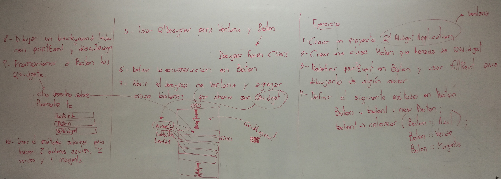

.. -*- coding: utf-8 -*-

.. _rcs_subversion:

Clase 15 - POO 2017
===================

Enumeraciones
^^^^^^^^^^^^^

- Es un tipo especial de variable
- Sus valores son constantes enteras
- Estos valores pueden ser autogenerados (0, 1, 2, 3, ...)

.. code-block:: c	

	enum los_dias { DOM, LUN, MAR, MIE, JUE, VIE, SAB } dia;

	enum los_dias { DOM = 7, LUN = 1, MAR, MIE, JUE = 0, VIE, SAB };

- Las variables de este tipo pueden adoptar sólo valores DOM, LUN, ...
- Es decir, la variable "dia" puede tomar DOM o LUN o MAR ...
- Las enumeraciones declaradas dentro de una clase tiene la visibilidad de la clase

.. code-block:: c	

	class Dia  {
	public:
	    enum los_dias { LUN, MAR, MIE, JUE, VIE };
	    int un_dia;
	};

	int main(int argc, char** argv)  {
	    Dia d1;
	    d1.un_dia = Dia::LUN;
	}

**Ejercicio 15**
 

