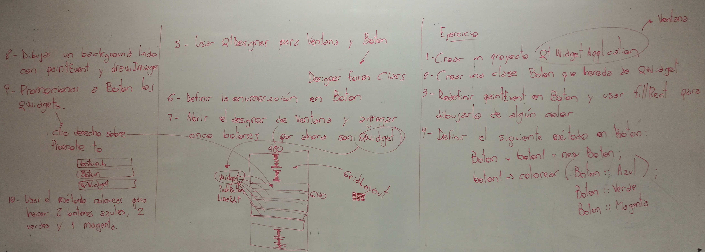

.. -*- coding: utf-8 -*-

.. _rcs_subversion:

Clase 16 - POO 2018
===================
(Fecha: 14 de mayo)

Clase QTimer
^^^^^^^^^^^^

- Permite programar tareas de una sola ejecución o tareas repetitivas. 
- Conectamos la señal ``timeout()`` con algún slot.
- Con ``start()`` comenzamos y la señal ``timeout()`` se emitirá al terminar.

**Ejemplo (repetitivo):** Temporizador que cada 1000 mseg llamará a ``slot_update()``

.. code-block:: c

	QTimer *timer = new QTimer(this);
	connect(timer, SIGNAL(timeout()), this, SLOT(slot_update()));
	timer->start(1000);
 
**Para una sola ejecución**

- Para temporizador de una sola ejecución usar ``setSingleShot(true)``
- El método estático ``QTimer::singleShot()`` nos permite la ejecución.

**Ejemplo:** Luego de 200 mseg se llamará a ``slot_update()``:

.. code-block:: c

	QTimer::singleShot(200, this, SLOT(slot_update()));
	// donde this es el objeto que tiene definido el slot_update().
	

Uso de Qt Designer
..................

- Nuevo proyecto -> Qt GUI Application
- Utilizar el puntero ``ui`` para acceder a los objetos del diseño
- Tener en cuenta que los métodos virtuales de QWidget para eventos se pueden usar:

.. code-block:: c	

	virtual void mousePressEvent(QMouseEvent* event);
	virtual void resizeEvent(QResizeEvent* event);
	virtual void moveEvent(QMoveEvent* event);
	...

**Ejemplo**

.. code-block:: c	
	
	// ventana.h
	#ifndef VENTANA_H
	#define VENTANA_H

	#include <QWidget>

	namespace Ui {
	    class Ventana;
	}

	class Ventana : public QWidget  {
	    Q_OBJECT

	public:
	    explicit Ventana(QWidget *parent = 0);
	    ~Ventana();

	private:
	    Ui::Ventana *ui;
	};

	#endif // VENTANA_H

.. code-block:: c

	// ventana.cpp
	#include "ventana.h"
	#include "ui_ventana.h"

	Ventana::Ventana(QWidget *parent) : QWidget(parent), ui(new Ui::Ventana)  {
	    ui->setupUi(this);
	}

	Ventana::~Ventana()  {
	    delete ui;
	}

**Ejercicio 14**

- Usar QtDesigner
- Definir la clase Ventana que herede de QWidget
- Buscar una imagen de un fútbol con formato PNG (para usar transparencias).
- Ventana tendrá un formulario que pide al usuario:
	- Diámetro del fútbol (píxeles):
	- Velocidad (mseg para ir de lado a lado):
	- QPushButton para actualizar el estado.
- El fútbol irá golpeando de izquierda a derecha en Ventana.

Métodos virtuales de QWidget para capturar eventos
^^^^^^^^^^^^^^^^^^^^^^^^^^^^^^^^^^^^^^^^^^^^^^^^^^

- Algunos de ellos:

.. code-block:: c

	virtual void mouseDoubleClickEvent(QMouseEvent* event);
	virtual void mouseMoveEvent(QMouseEvent* event);
	virtual void mousePressEvent(QMouseEvent* event);
	virtual void keyPressEvent(QKeyEvent* event);
	virtual void resizeEvent(QResizeEvent* event);
	virtual void moveEvent(QMoveEvent* event);
	virtual void closeEvent(QCloseEvent* event);

- Estos métodos pueden ser reimplementados en una clase derivada para recibir los eventos.

const
.....

- Una variable definida como const no podrá ser modificada a lo largo del programa (se crea como sólo lectura)
- Se puede aplicar a cualquier tipo:

.. code-block:: c	

	const float pi = 3.14;
	const peso = 67;	// Si no se indica el tipo entonces es int
					    // Ojo: Sólo en compiladores viejos

const con punteros
^^^^^^^^^^^^^^^^^^

.. code-block:: c	

	int x = 10;
	int* px = &x;		// normal

	const int y = 10;
	int* py = &y;	// El compilador dirá: "invalid conversion from const int*
					// to int*". La inversa sí se permite

	int y = 10;
	const int* py = &y;	// permitido (pero el contenido es de sólo lectura)

	*py = 6;  // No permitido. El contenido apuntado es de sólo lectura

const en parámetros de funciones
^^^^^^^^^^^^^^^^^^^^^^^^^^^^^^^^

- Cuando los parámetros son punteros, decimos que no podrá modificar los objetos referenciados

.. code-block:: c	

	int funcion(const char* ch)

- Lo mismo sucede con referencias

.. code-block:: c	

	int funcion(const char& ch)

const en clases
^^^^^^^^^^^^^^^

.. code-block:: c	

	class ClaseA  {
	    const int i;
	    int x;

	public:
	    int funcion(ClaseA cA, const ClaseA &c)  {
	        cA.x = 1;
	        cA.i = 2;  // No compila. i es de sólo lectura.
	        c.x = 3;  // No compila. El objeto c es de sólo lectura.

	        return cA.x;
	    }
	}; 

.. code-block:: c	

	// A la variable i sólo la puede inicializar el constructor y sólo con la forma:
	ClaseA() : i(8)  {  }   

	// Si en el cuerpo del constructor se hace:
	ClaseA()   { 
	    i = 8;  // Compila? i es de solo lectura o no
	}   

- Aplicado a métodos de una clase no permite modificar ninguna propiedad de la clase

.. code-block:: c	

	class ClaseB  {
	    int x;

	    void funcion(int i) const  {
	        x = x + i;  // Compila?
	    }
	};

Clase QCryptographicHash
^^^^^^^^^^^^^^^^^^^^^^^^

- Provee la generación de la clave hash 
- Soporta MD5, MD4 y SHA-1

.. code-block:: c

	enum Algorithm { Md4, Md5, Sha1 }

	QCryptographicHash(Algorithm metodo)

	void addData(const QByteArray & data)
	
	void reset()

	QByteArray result() const

**Método estático**

.. code-block:: c

	QByteArray hash(const QByteArray & data, Algorithm metodo)

**Otros métodos útiles**

.. code-block:: c

	QByteArray QByteArray::toHex()
	// Devuelve en hexadecimal
	// Útil para enviar por url una clave hash MD5
	// Hexadecimal tiene sólo caracteres válidos para URL

**Ejemplo**: Obtener MD5 de la clave ingresada en un QlineEdit:

.. code-block:: c

	QcryptographicHash::hash(leClave->text().toUtf8(), QCryptographicHash::Md5).toHex()
	
**Calculadora MD5 online**

http://md5calculator.chromefans.org/?langid=es

**Ejercicio 13**

- Diseñar una aplicación con un login inicial que valide contra la base
- Almacenar sólo el hash en MD5 de las contraseñas
- Si el usuario es válido mostrar cualquier widget ya creado (Maps, Imagen, paint)
- Registrar en la tabla 'logs' los intentos fallidos de logueo

API de Google Street
^^^^^^^^^^^^^^^^^^^^

- Permite descargar una vista
- Puede utilizarse con una clave de API para la aplicación
	- Acceder a https://code.google.com/apis/console y loguearse
	- Administración de las API - Google Street View Image API
	- Habilitar el servicio
	- Credenciales - Crear credenciales - Clave de Servidor o Clave de navegador

- Parámetros de la URL:
	- https://developers.google.com/maps/documentation/streetview

- Parámetros obligatorios
	- size - Imagen en píxeles. Por ejemplo, ``size=600x400`` (máximo 640x640)
	- location - Texto (universidad blas pascal) o lat./long. (40.457375,-80.009353)
	- sensor - Si el dispositivo dispone de GPS "true" o "false"

- Ejemplo: http://maps.googleapis.com/maps/api/streetview?size=400x400&location=donato%20alvarez%20380&sensor=false

- Opcionales:
	- heading - Rotación entre 0 y 360 (heading=45)
	- fov (field of view) - zoom (aprox. entre 10 y 120 - valor predeterminado 90)
	- pitch - Ángulo de inclinación (predeterminado 0 - entre -90 y 90)
	- key: Clave de API (ver https://code.google.com/apis/console)

**Ejercicio 16**

- Con la misma idea que la clase Mapa, hacer ahora la clase ``StreetView``. 
- En un QLineEdit ingresar el domicilio a buscar.
- Con sólo movimientos del mouse horizontales, girar la rotación entre 0 y 360.

**Ejercicio 17**

- Agregar a ``StreetView`` lo siguiente:
- Agregar un QSlider para controlar el zoom.
- Además del QSlider, controla el zoom con dobleclic derecho para aumentarlo y con el izquierdo para disminuirlo.
- Actualizar también la posición del QSlider luego de los dobleclics.
- Almacenar todas las direcciones buscadas en la tabla ``logs`` de la base de datos		
	

Enumeraciones
^^^^^^^^^^^^^

- Es un tipo especial de variable
- Sus valores son constantes enteras
- Estos valores pueden ser autogenerados (0, 1, 2, 3, ...)

.. code-block:: c	

	enum los_dias { DOM, LUN, MAR, MIE, JUE, VIE, SAB } dia;

	enum los_dias { DOM = 7, LUN = 1, MAR, MIE, JUE = 0, VIE, SAB };

- Las variables de este tipo pueden adoptar sólo valores DOM, LUN, ...
- Es decir, la variable "dia" puede tomar DOM o LUN o MAR ...
- Las enumeraciones declaradas dentro de una clase tiene la visibilidad de la clase

.. code-block:: c	

	class Dia  {
	public:
	    enum los_dias { LUN, MAR, MIE, JUE, VIE };
	    int un_dia;
	};

	int main(int argc, char** argv)  {
	    Dia d1;
	    d1.un_dia = Dia::LUN;
	}

**Ejercicio 15**
 

Un par de memes antes del examen
^^^^^^^^^^^^^^^^^^^^^^^^^^^^^^^^

.. figure:: images/clase10/meme2.jpg

