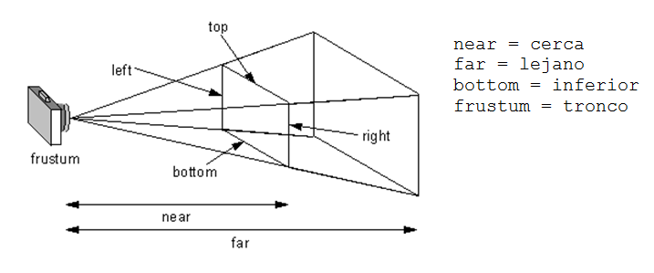
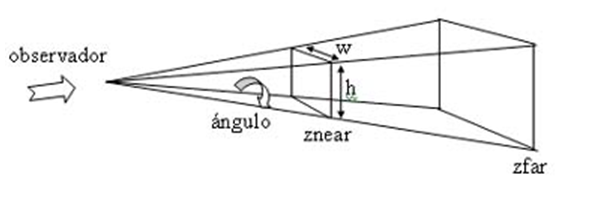

.. -*- coding: utf-8 -*-

.. _rcs_subversion:

Clase 21 - POO 2017
===================

:Tarea para Clase 23:
	Ver `Tutorial Qt QFile <https://www.youtube.com/watch?v=zDA5FKfRxJA>`_ de `Videos tutoriales de Qt <https://www.youtube.com/playlist?list=PL54fdmMKYUJvn4dAvziRopztp47tBRNum>`_

	Ver `Tutorial Qt QDir <https://www.youtube.com/watch?v=wfabCN1oJpE>`_ de `Videos tutoriales de Qt <https://www.youtube.com/playlist?list=PL54fdmMKYUJvn4dAvziRopztp47tBRNum>`_

	Ver `Tutorial Qt Resource file <https://www.youtube.com/watch?v=u8xKE0zHLsE>`_ de `Videos tutoriales de Qt <https://www.youtube.com/playlist?list=PL54fdmMKYUJvn4dAvziRopztp47tBRNum>`_	

	Repasar todo lo que está en GitHub sobre OpenGL hasta la clase 19

Modelo de sombreado
^^^^^^^^^^^^^^^^^^^

- Lo especificamos con la función ``glShadeModel()``. ``(shade = tono - matiz)``
- Si el parámetro es ``GL_FLAT`` se rellena con el úlimo color activo. ``(flat = plano)``
- Con ``GL_SMOOTH`` se interpolan los colores de cada vértice. ``(smooth = suavizar)``

.. code-block:: c
     
	glShadeModel(GL_SMOOTH);	
	glBegin(GL_TRIANGLES);
	    glColor3f(1, 0, 0); // activamos el color rojo
	    glVertex3f(-1.0f, -0.5f, 0.0f);
	    glColor3f(0, 1, 0); // activamos el color verde
	    glVertex3f(1.0f, 0.0f, 0.0f);
	    glColor3f(0, 0, 1); // activamos el color azul
	    glVertex3f(0.3f, 1.0f, 0.0f);
	glEnd();

**Transformación de viewport (o vista)**

- Análogamente con una cámara de fotos, es el tamaño de la fotografía.
- Generalmente se inicializa para que ocupe toda la ventana.
- Pensar en la relación ancho / alto.

.. code-block:: c

	void glViewport(GLint x, GLint y, GLsizei width, GLsizei height);
	
**Proyecciones**

- La proyección define el volumen del espacio que va a usarse para formar la imagen.
- Los vértices de la escena es afectada por la matriz de proyección.
- Es necesario activarla e inicializarla:

.. code-block:: c

	glMatrixMode(GL_PROJECTION);
	glLoadIdentity();

**Proyección ortogonal**

- Define un volumen de la vista como una "caja".
- La distancia de un objeto a la cámara no influye en su tamaño.

.. code-block:: c

	void glOrtho(GLdouble left, GLdouble right, GLdouble bottom, GLdouble top, GLdouble near, GLdouble far)

.. figure:: images/clase21/ortogonal.png

.. figure:: images/clase21/proyeccion_ortogonal.png

**Proyección perspectiva**

- Define un volumen de la vista como una pirámide truncada (o frustum).
- Los objetos aparecen más pequeños mientras más alejados están de la cámara.

.. code-block:: c

	void glFrustum(GLdouble left, GLdouble right, GLdouble bottom, GLdouble top, GLdouble near, GLdouble far)
	

.. code-block:: c

	void gluPerspective(angulo, aspecto, znear, zfar);

- Es muy común usar:

.. code-block:: c

	gluPerspective(45.0f,(GLfloat)(width/height), 0.01f, 100.0f);
	// donde width y height es el ancho y alto de la escena

- Para utilizar ``gluPerspective`` es necesario linkear a la librería en el .pro:

.. code-block:: c
	
	// Para Linux
	unix:LIBS += "/usr/lib/x86_64-linux-gnu/libGLU.so"

	// Para Windows
	win32::LIBS += -lGLU	

	// Posiblemente también requiera incluir el archivo de cabecera:
	#include <GL/glu.h>

**Ejercicio 32**

- Dibujar un triángulo dentro del campo de visión de la escena.
- Active un temporizador (100 ms) para que gire 3° el triángulo sobre el eje z.	
		   

**Posicionando la cámara**

- La siguiente función realiza el efecto del posicionamiento de la cámara.

.. code-block:: c

	void gluLookAt(GLdouble ojoX, GLdouble ojoY, GLdouble ojoZ, 
	               GLdouble haciaX, GLdouble haciaY, GLdouble haciaZ, 
	               GLdouble upX, GLdouble upY, GLdouble upZ)
				   
.. figure:: images/clase22/lookat.png		

**Ejercicio 33**

- Marcar 4 puntos en la escena donde se haga clic con el mouse.
- Ni bien se marque el 4to, automáticamente se generará el polígono de 4 vértices.
- Con la tecla C se puede cambiar entre distintos colores de relleno.
- Con A y D se rota sobre el eje Y.
- Con W y S se rota sobre el eje X.

**Ejercicio 34**

- Dibujar un cuadrado cualquiera en el plano z=-2.
- Controlar la posición de la cámara con las teclas.
- La cámara siempre vertical y mirando al punto (0, 0, -100).

**Ejercicio 35**

- Dibujar una ruta con la línea blanca interrumpida.
- Con las teclas Up y Down acelerar y frenar

