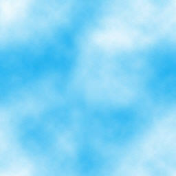
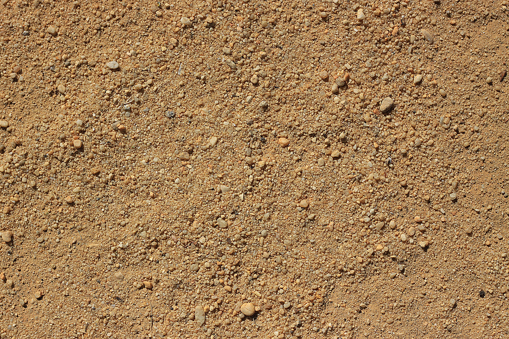
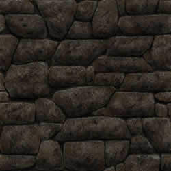
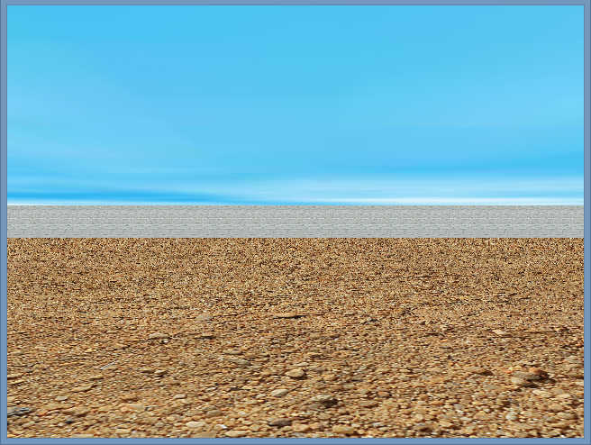
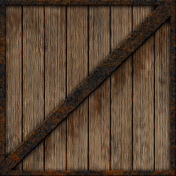

.. -*- coding: utf-8 -*-

.. _rcs_subversion:

Clase 23 - POO 2018
===================
(Fecha: 12 de junio)

Funciones inline
================

- Cuando decimos que llamamos a una función es porque salta, ejecuta y retorna.
- Una función inline inserta su código.
- Ventaja de ejecutarse más rápidamente.
- Como desventaja tenemos un programa generado más extenso.

.. code-block:: c

	#include <QDebug>
	#include <QApplication>

	inline int calculo(int a, int b)  {
	    return a/2+b;
	}

	int main(int argc, char** argv)  {
	    QApplication a(argc, argv);

	    int x=2, y=3, z=0;
	    z = calculo(x, y);

	    return 0;
	}

**Funciones miembro inline dentro de clases**

- Un método se declara dentro del cuerpo de la clase y se puede definir dentro o fuera
- Si se declara y define dentro, se denomina función inline. En este caso, no hace falta indicar con inline (está implícito).
- Si se define fuera, deberá indicar inline. De lo contrario será offline.
- Se recomienda usar funciones inline para funciones pequeñas y de uso frecuente.

.. code-block:: c

	#include <QDebug>
	#include <QApplication>

	class ClaseA  {
	private:
	    int x;
	    int y;

	public:
	    ClaseA() : x(10), y(20)  {  }
	    int getX()  {  return x;  }     // inline implícito
	    int getY();
	};

	inline int ClaseA::getY()  {
	    return y;
	}

	int main(int argc, char** argv)  {
	    QApplication a(argc, argv);

	    ClaseA cA;
	    qDebug() << cA.getX();
	    qDebug() << cA.getY();

	    return 0;
	}
	

Declaraciones friend
====================

- Miembros privados no son accesibles para funciones y clases externas
- Podemos usar friend en caso de necesitar acceder
- Se pueden aplicar a clases o métodos
- Inhabilitan el sistema de protección (protected o private)
- La amistad no es transferible

.. code-block:: c
	
	A es amigo de B     B amigo de C     No por eso A es amigo de C

- No se hereda

.. code-block:: c

	A amigo de B     C derivada de B     No por eso A es amigo de C

- No simétrica

.. code-block:: c

	A amigo de B     No por eso B es amigo de A

**Funciones amigas**

.. code-block:: c

	#include <iostream>
	using namespace std;

	class ClaseA  {
	public:
	    ClaseA(int i) : a(i)  {  }
	    void verA()  {  cout << a << endl;  }

	protected:
	    int a;
	    friend void mostrarA(ClaseA);  // mostrarA es amiga de ClaseA
	};

	void mostrarA(ClaseA cA)  {  // Esta función no pertenece a ClaseA
	    cout << cA.a << endl;   // Pero al ser amiga puede acceder a 'a'
	}

	int main(int argc, char** argv)  {
	    ClaseA objetoA(10);
	    mostrarA(objetoA);
	    objetoA.verA();

	    return 0;
	}
 
**Función amiga en otra clase**

.. code-block:: c

	#include <iostream>
	using namespace std;

	class ClaseA;	// Declaración

	class ClaseB  {
	public:
	    ClaseB(int i) : b(i)  {  }
		
	    void ver()  { cout << b << endl;  }
		
	    bool esMayor(ClaseA cA)  {  // Compara
	        return b > cA.a;
	    }
		
	private:
	    int b;
	};

	class ClaseA  {
	public:
	    ClaseA(int i) : a(i)  {  }
	    void ver()  { cout << a << endl; }

	private:
	    friend bool ClaseB::esMayor(ClaseA);
	    int a;
	};

	int main(int argc, char** argv)  {
	    ClaseA objetoA(10);
	    ClaseB objetoB(2);

	    objetoA.ver();	
	    objetoB.ver();

	    if (objetoB.esMayor(objetoA))
	        cout << "objetoB > objetoA" << endl;
	    else
	        cout << "objetoB < objetoA" << endl;

	    return 0;
	}
	
Levantar base de datos a QTableView
===================================

- Colocar con el QtDesigner un QTableView

.. code-block:: c

	QSqlRelationalTableModel * tableModelAlumnos;
	tableModelAlumnos = new QSqlRelationalTableModel(this, adminDB->getDB()); 

	tableModelAlumnos->setTable("alumnos");  // Tabla de la base

	// Para modificar como una planilla de excel
	tableModelAlumnos->setEditStrategy(QSqlTableModel::OnManualSubmit); 

	// Otra relación. En lugar de mostrar el id_carrera que muestre el nombre de la carrera.
	tableModelAlumnos->setRelation(5, QSqlRelation("carreras", "id", "nombre"));

	tableModelAlumnos->select();  // Hace la consulta.

	// Títulos de las columnas en el widget.
	tableModelAlumnos->setHeaderData(1, Qt::Horizontal, "Legajo");
	tableModelAlumnos->setHeaderData(2, Qt::Horizontal, "Nombre");
	tableModelAlumnos->setHeaderData(3, Qt::Horizontal, "Apellido");
	tableModelAlumnos->setHeaderData(4, Qt::Horizontal, "Mail");
	tableModelAlumnos->setHeaderData(5, Qt::Horizontal, "Carrera"); 

	// Seteamos el QSqlTableModel sobre el QTableView
	ui->tableViewAlumnos->setModel(tableModelAlumnos);

	// Lista desplegable con el nombre de la carrera, esto cuando se modifique la celda.
	ui->tableViewAlumnos->setItemDelegate(new QSqlRelationalDelegate(ui->tableViewAlumnos));

	// Ocultamos la columna id de la tabla alumnos.
	ui->tableViewAlumnos->setColumnHidden(0, true);

	// Ajusta el ancho de la celda con el texto en su interior. Para todas las columnas.
	ui->tableViewAlumnos->resizeColumnsToContents(); 
	
.. code-block:: c

	void Principal::slot_guardarCambios()  {    // Guada todos los cambios 
	    tableModelAlumnos->submitAll();
	}

	void Principal::slot_deshacer()  {  // Deshace todos los cambios que hizo el usuario.
	    tableModelAlumnos->revertAll();
	}

**Ejercicio 34**

- Hacerlo funcionar mostrando la tabla usuarios y su relación con tabla carreras
- Tabla alumnos: id, legajo, nombre, apellido, mail, id_carrera
- Tabla carreras: id, nombre
- Usar QtDesigner
		

Texturas
========

- Con la texturización agregamos una imagen a un polígono.
- En lugar de ver un color plano o color en degradé, veremos una imagen proyectada.

**Cargando texturas en memoria**

- Las dimensiones de las texturas tienen que ser potencias de 2 (64x64, 128x64, etc.).
- Tendremos un puntero a un segmento de memoria que contiene la imagen:

.. code-block:: c++

	unsigned char *textura;

	QImage im;
	if (!im.load(":/recursos/pared.bmp"))
	    QMessageBox::critical(this, "Recurso no disponible", "No pudo ser cargada.");

	im = QGLWidget::convertToGLFormat( im );
	textura = im.bits();

**Pasando las texturas a OpenGL**

- Cuando le pasamos la textura a OpenGL, éste nos devolverá un identificador.
- Cada textura tendrá un identificador propio.
- ¿Cómo obtenemos ese identificador? Creamos una variable para almacenarlo:

.. code-block:: c++

	GLuint idTextura;

- Llamamos a ``glGenTextures(...)`` pasando la cantidad de texturas que queremos generar y un array donde queremos almacenar los identificadores. 
- En este caso, sólo queremos una textura, y por lo tanto no hace falta pasarle un array, sino un puntero a una variable de tipo GLuint.

.. code-block:: c++

	glGenTextures(1, &idTextura);  // este ultimo parámetro es GLuint *textures

- OpenGL pondrá en ``idTextura`` el valor del identificador. 
- Con ``glBindTexture(...)`` asignamos el valor de idTextura, a una textura de destino. 
- Es decir, activamos la textura asignada a idTextura, y todas las propiedades que modifiquemos, serán modificaciones de esa textura.

.. code-block:: c++

	glBindTexture(GL_TEXTURE_2D, idTextura);

- Ahora lo más importante, pasarle la textura a OpenGL. Con ``glTexImage2D(...)``.

.. code-block:: c++

	glTexImage2D(GL_TEXTURE_2D, 0, 3, anchoTextura, altoTextura, 0, GL_RGB, GL_UNSIGNED_BYTE, textura);

donde:

.. code-block:: c++

	void glTexImage2D(
	    GLenum tipoTextura,  // Ahora es GL_TEXTURE_2D
	    GLint nivelMipMap,  // Nivel de MipMapping. Por ahora ponemos 0
	    GLint formatoInterno,  // Nro de componentes de colorde textura. Si es RGB entonces es 3
	    GLsizei ancho,  // Ancho de la textura. Recordar que es potencia de 2
	    GLsizei alto,  // Alto de la textura. Recordar que es potencia de 2
	    GLint borde,  // Anchura del borde. Debe ser 0
	    GLenum formato,  // Formato de la textura en memoria. Usamos GL_RGBA
	    GLenum tipo,  // Tipo de variable con que almacenamos la textura. Si la 
	                  // almacenamos en unsigned char entonces GL_UNSIGNED_BYTE
	    const GLvoid *pixels  // El puntero a la región de memoria donde se almacena
	);

**Visualización de una textura**

- Texel es la unidad mínima de textura
- Si la textura es de 64 x 64 píxeles y la mostramos completa en una 1024x768.
- OpenGL escalará estos píxeles, de manera que cada píxel de la textura (de ahora en adelante téxel) ocupará 16x12 píxeles en la pantalla.

.. code-block:: c++

	1024 píxeles de ancho / 64 téxeles de ancho = 16;
	768 píxeles de alto / 64 téxeles de alto = 12;

- Lo que veremos serán "cuadrados" de 16x12.
- Poco realista ver una textura *pixelizada*.
- Podemos aplicar filtros.
- El más común es el *filtro lineal*, que hace una interpolación.

.. code-block:: c++

	glTexParameteri(GL_TEXTURE_2D, GL_TEXTURE_MAG_FILTER, GL_LINEAR);
	glTexParameteri(GL_TEXTURE_2D, GL_TEXTURE_MIN_FILTER, GL_LINEAR);

- Con esto estamos parametrizando dos filtros. 
- Uno para cuando la textura se representa más grande de lo que es en realidad.
- Y otro para cuando la textura es más pequeña.
- Le decimos que haga un filtro lineal. 
- También podríamos decirle que no aplique ningún filtro ``(GL_NEAREST)``.

**Renderizando con texturas**

- Ya teniendo las texturas cargadas y ajustadas, dibujamos polígonos con texturas.
- Supongamos dibujar un simple cuadrado con la textura cargada.
- Si lo dibujamos sin textura seria:

.. code-block:: c++

	glBegin (GL_QUADS);
	    glVertex3i (-100, -100, -5);
	    glVertex3i (-100, 100, -5);
	    glVertex3i (100, 100, -5);
	    glVertex3i (100, -100, -5);
	glEnd ();

- Aplicando textura sería:

.. code-block:: c++
	glEnable(GL_TEXTURE_2D);	// Activamos la texturización
	glBindTexture(GL_TEXTURE_2D, idTextura);	// Activamos la textura con idTextura

	glBegin (GL_QUADS);
	    glTexCoord2f(0.0f, 0.0f);    glVertex3i (-100, -100, -5);
	    glTexCoord2f(1.0f, 0.0f);    glVertex3i (-100, 100, -5);
	    glTexCoord2f(1.0f, 1.0f);    glVertex3i (100, 100, -5);
	    glTexCoord2f(0.0f, 1.0f);    glVertex3i (100, -100, -5);
	glEnd ();

	glDisable(GL_TEXTURE_2D);  // Desactivamos la textura. Para que no intente
	                           // texturizar algo que dibujemos después.

- Con la función ``glTexCoord2f(0.0f, 0.0f)`` tenemos: Las coordenadas de textura. 

**Ejemplo:**

.. code-block:: c++
	
	// archivo ogl.h
	#ifndef OGL_H
	#define OGL_H

	#include <QGLWidget>

	class QTimer;

	class Ogl : public QGLWidget  {
	    Q_OBJECT

	public:
	    Ogl();
	    void setTimer(int timerIntervalo);

	protected:
	    virtual void initializeGL() = 0;
	    virtual void resizeGL(int width, int height) = 0;
	    virtual void paintGL() = 0;

	    virtual void keyPressEvent(QKeyEvent *e);

	    virtual void timeout();

	protected slots:
	    virtual void slot_timeout();

	private:
	    QTimer *timer;

	};

	#endif // OGL_H

.. code-block:: c++

	// Archivo ogl.cpp
	#include "ogl.h"

	#include <QTimer>
	#include <QKeyEvent>
	#include <QDebug>

	Ogl::Ogl()  {
	}

	void Ogl::setTimer(int timerIntervalo)  {
	    if(timerIntervalo > 0)  {
	        timerIntervalo = qMin(15, timerIntervalo);
	        timer = new QTimer(this);
	        connect(timer, SIGNAL(timeout()), this, SLOT(slot_timeout()));
	        timer->start(timerIntervalo);
	    }
	}

	void Ogl::keyPressEvent(QKeyEvent *e)  {
	    switch( e->key() )  {
	    case Qt::Key_Escape:
	        close();
	    }
	}

	void Ogl::slot_timeout()  {
	    this->timeout();
	}

	void Ogl::timeout()  {
	}

.. code-block:: c++

	// Archivo visual.h
	#include "ogl.h"
	
	class Visual : public Ogl  {
	    Q_OBJECT
	public:
	    Visual();
	protected:
	    void initializeGL();
	    void resizeGL(int ancho, int alto);
	    void paintGL();
	    void timeout();
	private:
	    void cargarTexturas();
	    unsigned char *textura;
	    GLuint idTextura;
	};
 
.. code-block:: c++

	// Archivo visual.cpp
	#include <GL/glu.h>

	Visual::Visual() : Ogl()  {
	}

	void Visual::initializeGL()  {
	    this->cargarTexturas();
	    glEnable(GL_TEXTURE_2D);
	    glShadeModel(GL_SMOOTH);
	    glClearColor(0.0f, 0.0f, 0.0f, 0.0f);
	    glClearDepth(1.0f);
	    glEnable(GL_DEPTH_TEST);
	}

	void Visual::resizeGL(int ancho, int alto)  {
	    glViewport( 0, 0, (GLint)ancho, (GLint)alto );
	    glMatrixMode(GL_PROJECTION);
	    glLoadIdentity();
	    gluPerspective(45.0f, (GLfloat)ancho/(GLfloat)alto, 1, 100.0f);
	    glMatrixMode(GL_MODELVIEW);
	    glLoadIdentity();
	}

	void Visual::paintGL()  {
	    glClear(GL_COLOR_BUFFER_BIT | GL_DEPTH_BUFFER_BIT);
	    glLoadIdentity();
	    glEnable(GL_TEXTURE_2D);  // Activamos la texturización
	    glBindTexture(GL_TEXTURE_2D, idTextura);  // Activamos la textura con idTextura

	    glBegin(GL_QUADS);
	        glTexCoord2f(0.0f, 0.0f);  glVertex3f(-2.0f, -2.0f,  -8);
	        glTexCoord2f(2.0f, 0.0f);  glVertex3f( 2.0f, -2.0f,  -8);
	        glTexCoord2f(2.0f, 1.0f);  glVertex3f( 2.0f,  2.0f,  -8);
	        glTexCoord2f(0.0f, 1.0f);  glVertex3f(-2.0f,  2.0f,  -8);
	    glEnd();
	    glDisable(GL_TEXTURE_2D);
	    glFlush();
	}

	void Visual::timeout()  {
	    this->updateGL();
	}

	void Visual::cargarTexturas()   {
	    QImage im;
	    if (!im.load(":/recursos/pared.bmp"))
	        QMessageBox::critical(this, "Recurso no disponible", "La imagen no pudo ser cargada.");
	    im = QGLWidget::convertToGLFormat( im );
	    textura = im.bits();

	    glGenTextures(1, &idTextura);  // Generamos 1 textura. Guardamos su id en idTextura.
	    glBindTexture(GL_TEXTURE_2D, idTextura);  // Activamos idTextura.    
	    glTexParameteri(GL_TEXTURE_2D, GL_TEXTURE_MAG_FILTER, GL_LINEAR); // GL_LINEAR - Interpolacion
	    glTexParameteri(GL_TEXTURE_2D, GL_TEXTURE_MIN_FILTER, GL_LINEAR); // GL_NEAREST - Sin 

	    glTexParameteri(GL_TEXTURE_2D, GL_TEXTURE_WRAP_S, GL_REPEAT);  // GL_CLAMP -    
	    glTexParameteri(GL_TEXTURE_2D, GL_TEXTURE_WRAP_T, GL_REPEAT);  // GL_REPEAT - Permite repetir
	    glTexImage2D(GL_TEXTURE_2D, 0, 3, im.width(), im.height(), 0, GL_RGBA, GL_UNSIGNED_BYTE, textura);
	}

**Ejercicio 34**

- Crear una aplicación para mostrar una escena 3D con OpenGL que tenga las siguientes características:
	- Utilizar la clase Ogl
	- La escena tendrá un cielo como se muestra a continuación:

- Ahora agregar una textura para el piso. Esta textura deberá repetirse para que quede similar a la siguiente figura:

- Dibujar ahora un muro al final del camino. Que la textura se repita también. 

	
- Utilizando las teclas UP y DOWN generar el efecto de avanzar y retroceder. Que no permita irse más allá del muro y que no permita retroceder más del punto inicial de partida.

**Ejercicio 35**

- En el ejercicio anterior colocar en el medio del escenario un cubo girando
- Pegar la siguiente textura en cada lado del cubo

